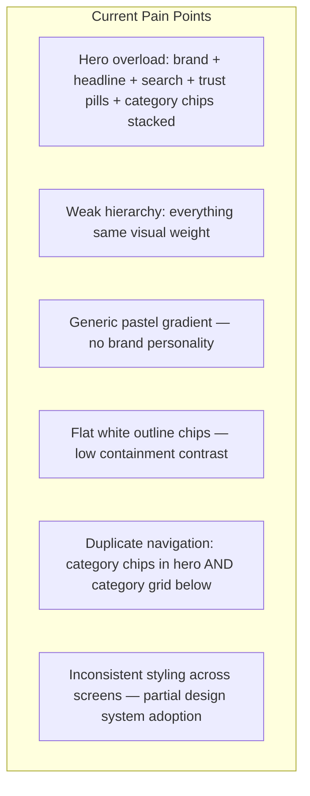
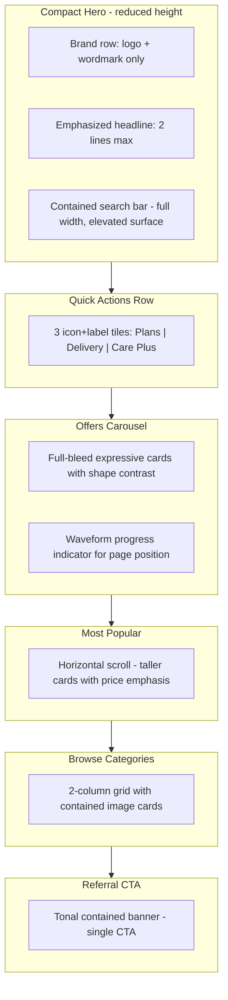

# GadgetChai M3 Expressive Redesign Plan

## Research Summary: What M3 Expressive Changes

Based on [Material 3 Expressive guidelines](https://m3.material.io/blog/building-with-m3-expressive), [foundations](https://m3.material.io/foundations), and [Google's UX research](https://design.google/library/expressive-material-design-google-research):

| Pillar | Standard M3 (current app) | M3 Expressive (target) |
|--------|----------------------------|------------------------|
| **Color** | Flat gradients, low-contrast chips | High-contrast containment; bold primary/secondary containers; tonal surface hierarchy |
| **Shape** | Uniform 12–16px radii, mild asymmetric hero | 10-step radius scale; contrasting corner radii per component role; shape morph on state change |
| **Typography** | Inter, uniform weights | Emphasized type scale (heavier display/headline); clearer size contrast between sections |
| **Motion** | Static `easeOutCubic` (200–500ms) | Spring-based physics; expressive scheme with subtle overshoot on hero moments |
| **Components** | Standard `NavigationBar`, `ActionChip`, `FilledButton` | Toolbars, button groups, split buttons, expressive progress indicators, larger tap targets |
| **Containment** | Thin-outline white cards | Grouped surfaces with `surfaceContainer` tiers; fewer, stronger visual groups |

**Research-backed goals for GadgetChai:** Users spot key actions up to 4x faster with expressive containment; 18–24 demographic strongly prefers expressive UIs (87%); larger buttons and high-contrast grouping improve accessibility for all ages.

**Flutter constraint:** Official M3 Expressive is not yet in Flutter core ([flutter#168813](https://github.com/flutter/flutter/issues/168813)). Recommended path: extend the existing `GcExpressiveTheme` token layer in [`app/lib/core/design/`](app/lib/core/design/) and selectively adopt community [`m3e_collection`](https://pub.dev/packages/m3e_collection) for navigation bar, buttons, toolbars, and progress indicators.

---

## Diagnosis: Why the Current Home Screen Feels Off

From the screenshot and [`home_tab.dart`](app/lib/features/home/home_tab.dart):



The app already has M3 scaffolding ([`theme.dart`](app/lib/core/theme.dart), [`expressive_theme.dart`](app/lib/core/design/expressive_theme.dart), [`gc_components.dart`](app/lib/core/widgets/gc_components.dart)) but applies it superficially — expressive shapes exist but color, motion, and containment do not yet deliver emotional impact.

---

## Design Direction: "Warm Tech Rental"

A **fresh expressive palette** for a Bangladesh consumer rental brand — approachable, energetic, trustworthy:

| Token | Proposed Value | Rationale |
|-------|---------------|-----------|
| **Primary** | Deep Coral-Orange `#E85D3A` | Warm, energetic — breaks from generic tech-blue SaaS look |
| **Secondary** | Rich Teal `#0D9488` | Trust, growth; pairs with coral for Bangladesh market warmth |
| **Tertiary** | Golden Amber `#F59E0B` | Offers, deals, referral highlights |
| **Surface tiers** | M3 `surfaceContainerLowest` → `Highest` with warm neutral base `#FFFBF7` | Tonal depth without flat white everywhere |
| **On-surface** | Warm charcoal `#1C1917` | Softer than cool slate |
| **Error/Warning** | Keep semantic reds/ambers, tuned to warm palette |

**Typography:** Replace Inter with **Plus Jakarta Sans** (Google Fonts) — geometric, friendly, strong emphasized weights. Map M3 emphasized styles: `displaySmall.emphasized` for hero headlines, `titleLarge.emphasized` for section headers, `labelLarge.emphasized` for CTAs.

**Shape language:** Assign contrasting radii by role:
- Hero/marketing surfaces: asymmetric `expressiveHero` (32/20/24/32)
- Product cards: medium uniform (16px)
- CTAs/buttons: fully rounded pills (28px height, 999 radius)
- Input/search: large contained (20px)
- Nav indicator: morphing pill (M3E nav bar)

---

## Architecture: Design System Restructure

Split the monolithic [`gc_components.dart`](app/lib/core/widgets/gc_components.dart) (838 lines) into atomic modules:

```
app/lib/core/design/
  tokens/
    app_colors.dart          # New warm palette + semantic colors
    app_typography.dart      # Plus Jakarta Sans + emphasized scale
    app_shapes.dart          # Extended 10-step radius + morph helpers
    app_motion.dart          # Spring curves + expressive durations
    app_spacing.dart         # (existing, minor tweaks)
  theme/
    app_theme.dart           # ThemeData builder
    expressive_theme.dart    # Extended GcExpressiveTheme
  widgets/
    surfaces/   gc_card, gc_expressive_surface, gc_contained_section
    navigation/ gc_bottom_nav, gc_toolbar
    inputs/     gc_search_bar, gc_chip_selector
    commerce/   gc_device_card, gc_price_tag, gc_promo_banner
    feedback/   gc_empty_state, gc_step_indicator, gc_progress
```

Add `m3e_collection` dependency for: `NavigationBarM3E`, `ButtonM3E`, `ButtonGroupM3E`, `ToolbarM3E`, `LoadingIndicatorM3E`, `ProgressIndicatorM3E`.

---

## Phase 1: Screen-by-Screen Redesign (Consumer App)

### 1. Splash + Onboarding

**Files:** [`splash_screen.dart`](app/lib/features/onboarding/splash_screen.dart), [`onboarding_screen.dart`](app/lib/features/onboarding/onboarding_screen.dart)

- **Splash:** Full-bleed warm gradient mesh (coral → teal), centered bolt logo with spring scale-in animation, emphasized display typography
- **Onboarding:** Replace flat PageView dots with expressive progress indicator; each slide uses a large illustrative container with asymmetric shape; bottom CTA uses pill `ButtonM3E` with shape-morph on press
- **Motion:** Spring entrance per slide; shared element transition from splash logo to home brand mark

### 2. Home Tab (highest impact)

**File:** [`home_tab.dart`](app/lib/features/home/home_tab.dart)

**New layout structure:**



**Key changes:**
- Remove category `ActionChip` row from hero (duplicates grid below) — replace with 3 contained quick-action tiles
- Demote trust pills from scrollable chips to icon tiles with `surfaceContainerHigh` backgrounds
- Promo slider: taller cards (220px), `expressiveFeature` shape, emphasized title typography, `FilledButton` with pill shape
- Popular devices: increase card height, add emphasized price, subtle spring on scroll snap
- Category grid: use `GcExpressiveSurface` with image + gradient overlay; remove thin border, use elevation/containment
- Referral banner: single contained surface with `ButtonM3E` tonal variant

### 3. Explore / Catalog

**File:** [`catalog_screen.dart`](app/lib/features/catalog/catalog_screen.dart)

- **App bar:** Replace default with `AppBarM3E` medium variant — search integrated in toolbar
- **Filters:** Sidebar on tablet uses contained filter panel (`surfaceContainerLow`); mobile opens expressive bottom sheet with drag handle and spring animation
- **Chips:** Replace `FilterChip` with `GcChipSelector` using tonal containers (selected = `primaryContainer`, unselected = `surfaceContainer`)
- **Device grid:** Redesign `GcDeviceCard` — larger image ratio, emphasized price tag, availability badge with pill shape, spring press feedback
- **Budget slider:** Adopt `SliderM3E` with expressive track

### 4. Device Details

**File:** [`device_details_screen.dart`](app/lib/features/catalog/device_details_screen.dart)

- **Hero image:** `GcExpressiveSurface` with asymmetric bottom corners flowing into content
- **Term selector:** `ButtonGroupM3E` (1/3/6/12 months) replacing raw chips — shape morph between selected/unselected
- **Color picker:** Circular swatches with spring selection ring
- **Specs:** Contained expandable card with emphasized section title
- **Sticky footer:** Elevated `surfaceContainerHighest` bar with large pill "Add to cart" button (min 48dp height per M3E accessibility)
- **Migrate:** Replace all inline `AppColors.*` and hardcoded `fontSize: 11` with theme tokens

### 5. Cart

**File:** [`cart_tab.dart`](app/lib/features/checkout/cart_tab.dart)

- **Empty state:** Use redesigned `GcEmptyState` with illustration container
- **Cart items:** Contained cards with clear visual grouping (device info | options | price)
- **Care Plus toggle:** Expressive switch with tonal container explanation
- **Breakdown panel:** `surfaceContainerHigh` contained summary with emphasized total
- **Checkout CTA:** Full-width pill button, fixed bottom with safe area

### 6. Checkout + KYC Flow

**Files:** [`checkout_screen.dart`](app/lib/features/checkout/checkout_screen.dart), [`camera_kyc_screen.dart`](app/lib/features/checkout/camera_kyc_screen.dart), [`bkash_agreement_webview.dart`](app/lib/features/checkout/bkash_agreement_webview.dart), [`checkout_screen.dart` (status)](app/lib/features/checkout/checkout_screen.dart)

- **Step indicator:** Redesign `GcStepIndicator` with expressive progress bar (waveform style) connecting steps
- **Document upload cards:** Large contained tap targets with dashed expressive borders and icon
- **Camera KYC:** Dark overlay with contained instruction card; capture button as large FAB with spring
- **bKash screen:** Re-theme to use GadgetChai warm palette for chrome while preserving bKash pink `#E2136E` only for bKash-branded payment step (brand-appropriate hybrid)
- **Status screen:** Success/failure with spring-animated icon morph and emphasized headline

### 7. Account / My Tech

**File:** [`my_tech_screen.dart`](app/lib/features/rentals/my_tech_screen.dart)

- **Guest state:** Hero contained card with sign-up CTA; remove placeholder settings that don't work
- **Profile header:** Contained profile card with trust score as expressive circular progress indicator
- **KYC badge:** Pill badge with tonal container
- **Active rentals:** Timeline redesign with contained cards, emphasized dates, clear action button group (Report damage | Schedule return)
- **Rename nav label:** "Account" tab label stays, but screen title becomes "My Tech" with subtitle

### 8. Auth (Login)

**File:** [`login_screen.dart`](app/lib/features/auth/login_screen.dart)

- Warm mesh background (consistent with splash)
- Phone input in elevated contained surface
- Large pill "Send OTP" button
- OTP fields as contained digit boxes with spring focus transition

### 9. Damage Report

**File:** [`damage_report_screen.dart`](app/lib/features/rentals/damage_report_screen.dart)

- Migrate from raw `AppColors` to theme tokens
- Photo upload: same pattern as KYC document cards
- Submit: full-width expressive button

### 10. Navigation Shell

**File:** [`main_navigation_frame.dart`](app/lib/features/navigation/main_navigation_frame.dart)

- Replace `NavigationBar` with `NavigationBarM3E` — morphing indicator pill, larger icons (24dp), emphasized selected label
- Replace `NavigationRail` with `NavigationRailM3E` on tablet/desktop
- Cart badge: expressive pill badge with spring pop on count change

---

## Phase 2: Admin Dashboard (Later)

**File:** [`admin_dashboard_screen.dart`](app/lib/features/admin/admin_dashboard_screen.dart)

- Apply warm palette and typography
- Replace dense tables with contained data cards
- `fl_chart` charts wrapped in `GcCard` with expressive corners
- Tab bar uses `ButtonGroupM3E` for Analytics | Ledger | KYC | Fulfillment
- Out of Phase 1 scope — design tokens established in Phase 1 make this a straightforward pass

---

## Motion System Upgrade

**File:** [`app_motion.dart`](app/lib/core/design/app_motion.dart)

| Interaction | Current | Target |
|-------------|---------|--------|
| Page transitions | Default Material | `easeInOutCubicEmphasized` + 350ms |
| Button press | Ink ripple only | Spring scale 0.97 → 1.0 with `SpringSimulation` |
| Card appear (list) | None | Staggered fade+slide with 50ms offset |
| Tab switch | Instant IndexedStack | Cross-fade 200ms on tab content |
| Promo carousel | Linear page scroll | Spring physics on `PageController` |
| Nav indicator | Static pill | Morph animation via M3E nav bar |

Implement a shared `GcMotion` helper wrapping `AnimationController` + spring curves, used by all `Gc*` components.

---

## Implementation Phases & File Touch Order

### Phase 1A — Foundation (do first, unblocks all screens)
1. New color palette in [`theme.dart`](app/lib/core/theme.dart) → extract to `tokens/app_colors.dart`
2. Typography migration to Plus Jakarta Sans with emphasized scale
3. Extend [`expressive_theme.dart`](app/lib/core/design/expressive_theme.dart) with spring tokens
4. Add `m3e_collection` to [`pubspec.yaml`](app/pubspec.yaml)
5. Split `gc_components.dart` into widget modules
6. Update [`main.dart`](app/lib/main.dart) theme wiring

### Phase 1B — Shell + High-traffic screens
7. Navigation shell (`main_navigation_frame.dart`)
8. Home tab complete redesign
9. Catalog + device details
10. Cart + checkout flow

### Phase 1C — Account + polish
11. Auth, onboarding, splash
12. My Tech, damage report, bKash re-theme
13. Remove dead code (`GcPromoCard`, `GcPageHeader`, unused deps `glassmorphism`, `font_awesome_flutter`)
14. Enable dark theme (optional stretch — warm dark palette)

### Phase 2 — Admin
15. Admin dashboard token migration

---

## Accessibility & Usability Guardrails

Per M3 Expressive research — apply expressiveness **without** breaking patterns:
- Minimum 48dp tap targets on all primary actions
- Keep text labels on nav items and filter chips (no icon-only primary nav)
- WCAG AA contrast on all `onPrimary` / `onSurface` pairings — validate warm palette
- Do not remove familiar list/grid patterns in catalog (research showed unstructured layouts hurt usability)
- Test with Bangladesh locale: ৳ formatting, longer Bengali strings if i18n is planned

---

## Success Criteria

- Home hero reduced to 3 visual layers (brand, headline, search) — no chip overload
- 100% consumer screens use theme tokens (zero inline `AppColors` / hardcoded `TextStyle`)
- Navigation, buttons, and progress use M3E components
- Emphasized typography creates clear scan path: headline → search → offers → products
- Spring motion on hero moments (splash, promo tap, add-to-cart)
- Visual QA: side-by-side screenshot comparison showing warmer palette, stronger containment, and reduced visual noise

---

## Key References

- [M3 Expressive: Building with M3 Expressive](https://m3.material.io/blog/building-with-m3-expressive)
- [M3 Foundations](https://m3.material.io/foundations)
- [Expressive Design UX Research](https://design.google/library/expressive-material-design-google-research)
- [Flutter M3 Expressive tracking issue](https://github.com/flutter/flutter/issues/168813)
- [m3e_collection package](https://pub.dev/packages/m3e_collection)
