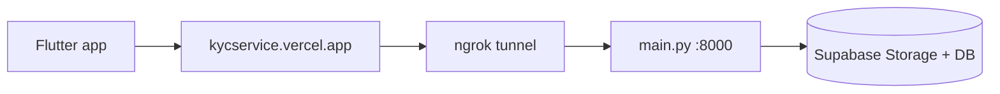

# GadgetChai

Device-as-a-Service (DaaS) rental platform for Bangladesh: rent laptops, phones, cameras, and consoles on monthly terms with **bKash tokenized billing** and **AI e-KYC** (NID OCR + face match).

| Layer | Tech | Location |
|-------|------|----------|
| Client | Flutter (Android primary, web optional) | `app/` |
| Database & payments | Supabase Postgres + Edge Functions | Cloud (`awaken` project) |
| KYC gateway | FastAPI JWT proxy | Vercel (`kycservice.vercel.app`) |
| KYC ML engine | EasyOCR + DeepFace | Local PC (`:8000`) via ngrok |

---

## Repository layout

```text
GadgetChai/
├── app/                    # Flutter client (Android + optional web)
├── kyc_service/            # ML worker (main.py) + Vercel gateway (api/gateway.py)
├── supabase/
│   ├── migrations/         # Schema + RLS (run in order)
│   ├── functions/          # bkash-webhook, charge-rentals
│   └── seed.sql            # Catalog / promos seed data
├── scripts/                # wire-production, sync-ngrok, health-check, seed
├── docs/                   # Detailed production & auth guides
├── .env.example            # Root secrets template (copy → .env)
└── package.json            # Node automation scripts
```

---

## Prerequisites

Install before cloning:

| Tool | Version | Purpose |
|------|---------|---------|
| [Flutter](https://docs.flutter.dev/get-started/install) | Stable 3.22+ | Android app |
| [Android Studio](https://developer.android.com/studio) | Latest | SDK, emulator, device deploy |
| [Node.js](https://nodejs.org/) | 18+ | Seed, wire-production, health-check |
| [Python](https://www.python.org/) | **3.11** (not 3.14) | KYC ML worker |
| [ngrok](https://ngrok.com/) | Free tier OK | Expose ML worker to Vercel |
| [Supabase CLI](https://supabase.com/docs/guides/cli) | Optional | Migrations / function deploy |

Accounts you need access to:

- Supabase project `fsdfqcnjcjtdmdjshrvu` (or your own fork)
- Vercel project for `kyc_service` (gateway already deployed at `kycservice.vercel.app`)

---

## Quick start (new developer)

### 1. Clone and install

```bash
git clone <repo-url> GadgetChai
cd GadgetChai

npm install

cd app && flutter pub get && cd ..
```

### 2. Environment files

```bash
# Root — used by scripts, ML worker, wire-production
cp .env.example .env

# Flutter — injected at build time
cp app/.env.example app/.env
```

Edit both files with your Supabase URL and anon/publishable keys from [Dashboard → Settings → API](https://supabase.com/dashboard/project/fsdfqcnjcjtdmdjshrvu/settings/api).

Add to root `.env` (not committed):

- `SUPABASE_SERVICE_ROLE_KEY` — for `npm run seed` and edge wiring
- `NGROK_API_KEY` — from [ngrok dashboard](https://dashboard.ngrok.com/api-keys)
- `CRON_SECRET` — `openssl rand -hex 32` (protects charge-rentals cron)

For **Android**, keep `CLIENT_APP_URL=gadgetchai://` in both `.env` and `app/.env`.

### 3. Supabase database

Run migrations **in filename order** in the [SQL Editor](https://supabase.com/dashboard/project/fsdfqcnjcjtdmdjshrvu/sql/new):

1. `supabase/migrations/20260706120000_gadget_chai_schema.sql`
2. `supabase/migrations/20260707120000_security_hardening.sql`
3. `supabase/migrations/20260707130000_charge_rentals_cron.sql`
4. `supabase/migrations/20260707140000_cron_settings_table.sql`
5. `supabase/migrations/20260707150000_service_role_grants.sql`
6. `supabase/migrations/20260707160000_fix_is_admin_rls_execute.sql`

Then seed catalog data:

```bash
npm run seed
```

(`setup-all.sql` is a legacy one-file bundle; prefer the ordered migrations above.)

### 4. Supabase Auth (email/password)

Configure the dashboard once — full checklist in [docs/SUPABASE_AUTH_SETUP.md](docs/SUPABASE_AUTH_SETUP.md):

- Enable **Email** provider, **Confirm email** ON
- Redirect URLs: `gadgetchai://**` (and `http://localhost:3000/**` for web)
- Disable phone OTP for now
- Enable leaked-password protection

### 5. Wire edge functions & secrets

From repo root (requires `SUPABASE_SERVICE_ROLE_KEY` in `.env`):

```bash
npm run wire-production
```

This syncs bKash sandbox credentials, `CLIENT_APP_URL`, KYC URLs, and cron secret to Supabase Edge Function secrets and Vercel.

---

## Running the app (Android)

**Terminal 1 — ML worker** (first time: see [KYC setup](#kyc-ml-worker--ngrok) below)

```bash
scripts\start-ml-worker.bat
```

**Terminal 2 — ngrok** (after ML worker is up)

```bash
scripts\start-ngrok.bat
```

**Terminal 3 — sync ngrok URL to Vercel** (run after every ngrok restart)

```bash
npm run sync-ngrok -- --deploy
```

**Terminal 4 — Flutter**

```bash
cd app
flutter run --dart-define-from-file=.env
```

Connect a physical device or an emulator with camera support.

More Android details: [app/README.md](app/README.md)

### Optional: Flutter web

```bash
cd app
flutter run -d chrome --web-port 3000 \
  --dart-define-from-file=.env \
  --dart-define=CLIENT_APP_URL=http://localhost:3000
```

---

## KYC: ML worker + ngrok

The Flutter app calls the **Vercel gateway** (`KYC_SERVICE_URL`). The gateway validates the Supabase JWT and proxies to your **local ML worker** via `ML_WORKER_URL` (ngrok public URL).



### First-time ML worker setup

```bash
cd kyc_service
python3.11 -m venv .venv

# Windows
.\.venv\Scripts\pip install -r requirements.txt
.\.venv\Scripts\pip install tf-keras "websockets>=13,<16" "supabase>=2.10"
```

Root `.env` must include `SUPABASE_URL`, `SUPABASE_SERVICE_ROLE_KEY`, `SUPABASE_ANON_KEY`, and `KYC_ALLOW_MOCK=false`.

Start the worker:

```bash
# From repo root
scripts\start-ml-worker.bat
```

Health check: `http://127.0.0.1:8000/health`

### ngrok workflow

1. Start ML worker on port `8000`
2. Run `scripts\start-ngrok.bat` (or `ngrok http 8000`)
3. Run `npm run sync-ngrok -- --deploy` to update `ML_WORKER_URL` on Vercel

Full KYC docs: [kyc_service/README.md](kyc_service/README.md) and [docs/PRODUCTION_SETUP.md](docs/PRODUCTION_SETUP.md#e-kyc-flow)

> **Note:** EasyOCR + DeepFace are large (~2–7 GB). First verification request downloads models. Use `KYC_ALLOW_MOCK=true` only for UI testing without ML.

---

## bKash sandbox (checkout)

Sandbox credentials are in `.env.example`. Test wallet: **01770618575** (PIN `12121`, OTP `123456`).

Flow: agreement (`mode 0000`) → initial payment (`mode 0001`) → redirect to `gadgetchai:///checkout/status`.

Details: [docs/PRODUCTION_SETUP.md](docs/PRODUCTION_SETUP.md#bkash-payment-flow)

---

## Verification

```bash
# All services (KYC gateway, ML/ngrok, optional web, charge-rentals)
npm run health-check

# Static analysis
cd app && flutter analyze
```

---

## npm scripts

| Script | Description |
|--------|-------------|
| `npm run seed` | Load catalog/promos via service role |
| `npm run wire-production` | Push secrets to Supabase + Vercel |
| `npm run sync-ngrok` | Read ngrok API → update `ML_WORKER_URL` |
| `npm run sync-ngrok -- --deploy` | Also redeploy `kyc_service` to Vercel |
| `npm run health-check` | Smoke-test endpoints |
| `npm run charge-rentals` | Manually invoke recurring billing edge fn |

---

## Documentation index

| Doc | Contents |
|-----|----------|
| [docs/PRODUCTION_SETUP.md](docs/PRODUCTION_SETUP.md) | Full sandbox/production wiring |
| [docs/SUPABASE_AUTH_SETUP.md](docs/SUPABASE_AUTH_SETUP.md) | Email auth dashboard steps |
| [docs/PRODUCTION_WIRING.md](docs/PRODUCTION_WIRING.md) | Secret sync checklist |
| [docs/PHASE_C_PRODUCTION.md](docs/PHASE_C_PRODUCTION.md) | Live bKash, VPS ML, go-live |
| [app/README.md](app/README.md) | Android deep links, permissions |
| [kyc_service/README.md](kyc_service/README.md) | KYC API reference |

---

## Security

- Never commit `.env` or `app/.env` (use `.env.example` templates).
- Rotate any keys that were ever committed or shared in chat.
- `SUPABASE_SERVICE_ROLE_KEY` is server-side only (scripts, ML worker, edge functions).

---

## Going live

When you have a bKash merchant account and a VPS for the ML worker, follow [docs/PHASE_C_PRODUCTION.md](docs/PHASE_C_PRODUCTION.md).
