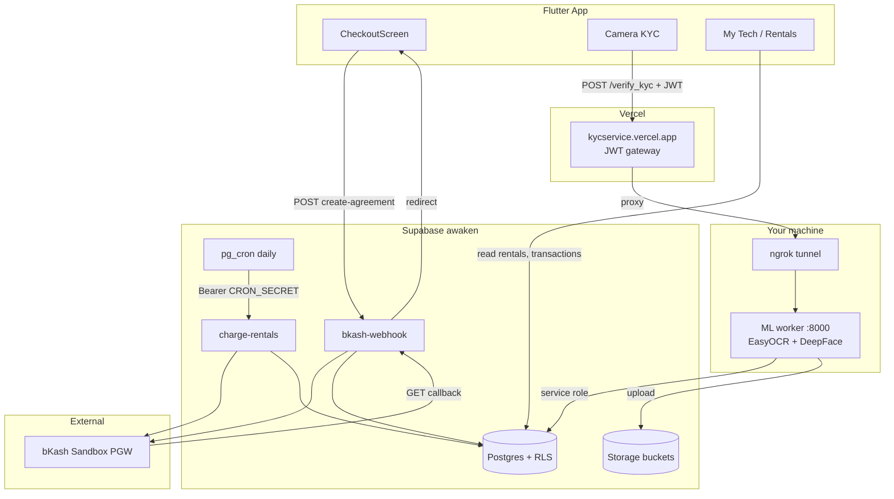
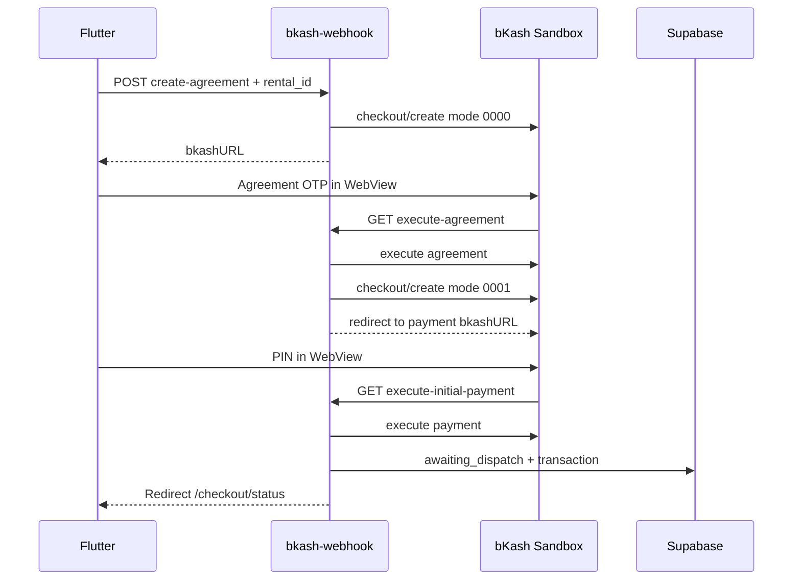
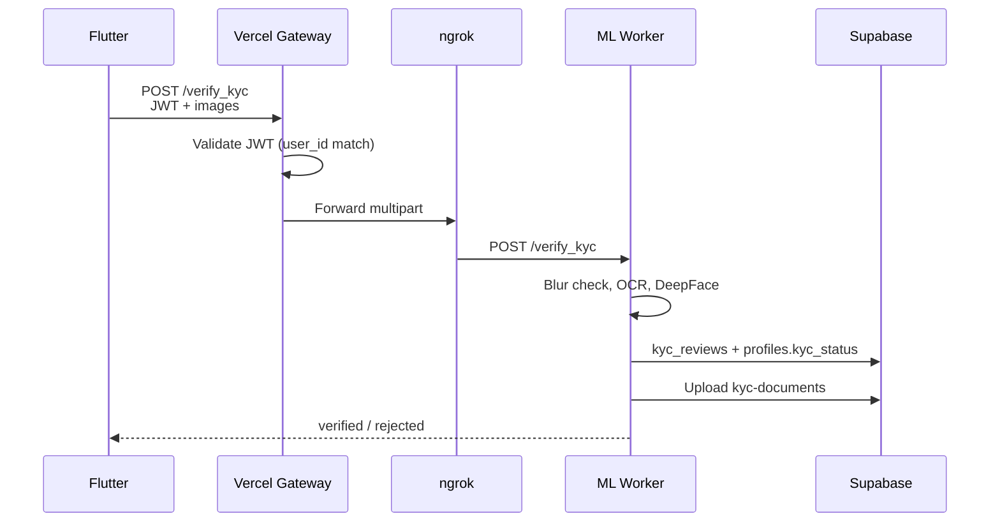

# GadgetChai Production Setup Guide

Complete reference for running GadgetChai in **sandbox** (development/staging) and preparing for **production**. Covers Supabase, bKash payments, e-KYC, recurring billing, Vercel, ngrok, and the Flutter client.

**Supabase project:** `awaken` · ref `fsdfqcnjcjtdmdjshrvu`  
**KYC gateway:** https://kycservice.vercel.app

---

## Table of contents

1. [Architecture](#architecture)
2. [Prerequisites](#prerequisites)
3. [Environment variables](#environment-variables)
4. [One-time setup](#one-time-setup)
5. [Daily development workflow](#daily-development-workflow)
6. [Supabase backend](#supabase-backend)
7. [bKash payment flow](#bkash-payment-flow)
8. [e-KYC flow](#e-kyc-flow)
9. [Recurring billing](#recurring-billing)
10. [Flutter app](#flutter-app)
11. [Automation scripts](#automation-scripts)
12. [Security hardening](#security-hardening)
13. [Verification checklist](#verification-checklist)
14. [Troubleshooting](#troubleshooting)
15. [Going live (production)](#going-live-production)
16. [Launch phases](#launch-phases)

---

## Launch phases

### Phase A — Free beta (implemented)

| Component | Approach |
|-----------|----------|
| Auth | Email + password, confirm email ([SUPABASE_AUTH_SETUP.md](./SUPABASE_AUTH_SETUP.md)) |
| bKash | Tokenized sandbox (`mode 0000` agreement → `0001` initial payment) |
| KYC | PC ML worker + ngrok → Vercel gateway |
| Cost | $0 (Supabase/Vercel/ngrok free tiers) |

### Phase B — Sandbox hardening

- Query Payment fallback on ambiguous execute (implemented in edge functions)
- Cancel agreement API (`action=cancel-agreement`)
- Password reset + account phone edit (implemented in Flutter)
- `npm run health-check` monitoring script
- Optional custom SMTP if email limits hit

### Phase C — Production (when merchant + VPS ready)

See [PHASE_C_PRODUCTION.md](./PHASE_C_PRODUCTION.md).

---

## Architecture



### Component summary

| Component | Location | Role |
|-----------|----------|------|
| Flutter app | `app/` | Customer + admin UI |
| `bkash-webhook` | Supabase Edge Function | Create agreement, handle bKash callback |
| `charge-rentals` | Supabase Edge Function | Monthly recurring charges |
| KYC gateway | Vercel `kyc_service` | JWT validation, proxy to ML worker |
| ML worker | Local `kyc_service/main.py` | OCR + face match (too large for Vercel) |
| ngrok | Local tunnel | Exposes ML worker to Vercel |

---

## Prerequisites

| Tool | Version / notes |
|------|-----------------|
| Flutter SDK | 3.22+ stable |
| Node.js | 18+ (for npm scripts) |
| Python | **3.11** recommended (3.14 lacks ML deps) |
| ngrok | [ngrok.com](https://ngrok.com) account + CLI |
| Vercel CLI | `npm i -g vercel` (logged in) |
| Supabase CLI | `npx supabase` (optional, for edge deploys) |

**Accounts & keys you need:**

- Supabase project access + [personal access token](https://supabase.com/dashboard/account/tokens) (`sbp_...`)
- Vercel team access (`codestormhub/kyc_service`)
- ngrok authtoken + API key ([dashboard](https://dashboard.ngrok.com))

---

## Environment variables

Copy `.env.example` → `.env` (root) and configure. Copy relevant keys to `app/.env` for Flutter.

### Root `.env` (server scripts + wiring)

| Variable | Required | Description |
|----------|----------|-------------|
| `SUPABASE_URL` | Yes | `https://fsdfqcnjcjtdmdjshrvu.supabase.co` |
| `SUPABASE_ANON_KEY` | Yes | Public anon JWT (Flutter + gateway auth) |
| `SUPABASE_SERVICE_ROLE_KEY` | Yes | Server-side only; never ship in app |
| `SUPABASE_PUBLISHABLE_KEY` | Optional | Modern publishable key |
| `KYC_SERVICE_URL` | Yes | Vercel gateway: `https://kycservice.vercel.app` |
| `ML_WORKER_URL` | Yes | Public ngrok URL to local `:8000` |
| `CLIENT_APP_URL` | Yes | Post-bKash redirect base (see Flutter) |
| `BKASH_APP_KEY` | Yes | bKash sandbox merchant key |
| `BKASH_APP_SECRET` | Yes | bKash sandbox secret |
| `BKASH_USERNAME` | Yes | Sandbox username |
| `BKASH_PASSWORD` | Yes | Sandbox password |
| `CRON_SECRET` | Yes | Random hex; protects `charge-rentals` |
| `KYC_ALLOW_MOCK` | Yes | `false` in sandbox/production |
| `ALLOWED_ORIGINS` | Yes | Comma-separated CORS origins |
| `NGROK_API_KEY` | Yes | For `npm run sync-ngrok` |
| `SUPABASE_ACCESS_TOKEN` | Wiring only | Pass in shell, do not commit |

### Flutter `app/.env` (dart-defines)

| Variable | Description |
|----------|-------------|
| `SUPABASE_URL` | Same as root |
| `SUPABASE_ANON_KEY` | Same as root |
| `KYC_SERVICE_URL` | Vercel gateway URL |
| `CLIENT_APP_URL` | Payment return URL |

Run with:

```bash
cd app
flutter run --dart-define-from-file=.env
```

### Supabase Edge Function secrets

Set via `npm run wire-production` or Dashboard → Edge Functions → Secrets:

| Secret | Notes |
|--------|-------|
| `BKASH_*` | Sandbox or live merchant credentials |
| `CRON_SECRET` | Must match root `.env` |
| `CLIENT_APP_URL` | Post-payment redirect base |

> Names starting with `SUPABASE_` are **reserved** — Supabase injects `SUPABASE_URL`, `SUPABASE_ANON_KEY`, and `SUPABASE_SERVICE_ROLE_KEY` automatically.

### Vercel (`kyc_service` project)

| Variable | Description |
|----------|-------------|
| `SUPABASE_URL` | Project URL |
| `SUPABASE_ANON_KEY` | JWT validation |
| `SUPABASE_SERVICE_ROLE_KEY` | If gateway needs DB (optional) |
| `ML_WORKER_URL` | ngrok HTTPS URL |
| `ALLOWED_ORIGINS` | CORS allowlist |
| `KYC_ALLOW_MOCK` | `false` |

---

## One-time setup

### 1. Clone and install

```bash
git clone <repo>
cd GadgetChai
cp .env.example .env
cp .env.example app/.env   # then trim to Flutter keys only
```

### 2. Generate secrets

```bash
# CRON_SECRET
openssl rand -hex 32
```

Fill bKash sandbox credentials (public test values in `.env.example`).

### 3. Configure ngrok

```bash
ngrok config add-authtoken <your-authtoken>
ngrok config add-api-key <your-api-key>
```

Add `NGROK_API_KEY` to `.env`.

### 4. ML worker Python environment

Use **Python 3.11** (not 3.14):

```bash
cd kyc_service

# Windows — use uv-managed Python 3.11 if available:
"C:\Users\<you>\AppData\Roaming\uv\python\cpython-3.11.15-windows-x86_64-none\python.exe" -m venv .venv

.\.venv\Scripts\pip install -r requirements.txt
.\.venv\Scripts\pip install tf-keras "websockets>=13,<16"
.\.venv\Scripts\pip install "supabase>=2.10"   # fixes httpx compatibility
```

### 5. Wire remote services

```bash
# From repo root — requires SUPABASE_ACCESS_TOKEN in shell
set SUPABASE_ACCESS_TOKEN=sbp_...    # Windows CMD
# $env:SUPABASE_ACCESS_TOKEN="sbp_..."  # PowerShell

npm run wire-production
```

This configures:

- Supabase Edge secrets (`BKASH_*`, `CRON_SECRET`, `CLIENT_APP_URL`)
- Vercel env vars on `kyc_service`
- `app_settings` table for pg_cron

### 6. Deploy edge functions (if not already deployed)

```bash
npx supabase functions deploy bkash-webhook --project-ref fsdfqcnjcjtdmdjshrvu
npx supabase functions deploy charge-rentals --project-ref fsdfqcnjcjtdmdjshrvu
```

### 7. Database migrations

Applied migrations (in order):

| File | Purpose |
|------|---------|
| `20260706120000_gadget_chai_schema.sql` | Core schema |
| `20260707120000_security_hardening.sql` | RLS, grants, private buckets |
| `20260707130000_charge_rentals_cron.sql` | pg_cron job |
| `20260707140000_cron_settings_table.sql` | `app_settings` for cron auth |
| `20260707150000_service_role_grants.sql` | Edge function table access |

Apply via Supabase Dashboard SQL editor, `supabase db push`, or Supabase MCP `apply_migration`.

---

## Daily development workflow

Start **three** processes for full sandbox E2E (KYC + payments):

### Terminal 1 — ML worker

```bash
scripts\start-ml-worker.bat
```

Or manually:

```bash
cd kyc_service
.\.venv\Scripts\python.exe -m uvicorn main:app --host 127.0.0.1 --port 8000
```

Wait for `Application startup complete`. First start downloads DeepFace/EasyOCR models (~minutes).

### Terminal 2 — ngrok

```bash
scripts\start-ngrok.bat
```

### Terminal 3 — Sync ngrok URL to Vercel

Whenever ngrok restarts (URL changes):

```bash
npm run sync-ngrok -- --deploy
```

### Terminal 4 — Flutter app

```bash
cd app
flutter run --dart-define-from-file=.env
```

---

## Supabase backend

### Edge functions (vendored in repo)

| Function | Auth | Endpoints |
|----------|------|-----------|
| `bkash-webhook` | JWT on `create-agreement`; GET callback from bKash only | `?action=create-agreement` (POST), `?action=execute-agreement` (GET) |
| `charge-rentals` | `Authorization: Bearer <CRON_SECRET>` | POST only |

Source: `supabase/functions/`

### Storage buckets

| Bucket | Access | Use |
|--------|--------|-----|
| `kyc-documents` | Private | NID front/back, selfie |
| `damage-reports` | Private | Signed URLs for admin |

### pg_cron recurring job

Job name: `gadgetchai-charge-rentals-daily`  
Schedule: `0 0 * * *` (00:00 UTC daily)

Reads `supabase_url` and `cron_secret` from `public.app_settings` (not `ALTER DATABASE`, which hosted Supabase blocks).

---

## bKash payment flow

Tokenized checkout per [bKash docs](https://developer.bka.sh/docs/tokenized-checkout-process):

1. **Create Agreement** (`mode: 0000`) — user enters wallet + OTP on bKash page
2. **Execute Agreement** — server stores `agreementID`
3. **Create Payment** (`mode: 0001`) — user enters PIN for deposit + first month
4. **Execute Payment** — rental → `awaiting_dispatch`



### Sandbox test wallets

| Source | Wallet | PIN | OTP |
|--------|--------|-----|-----|
| [Merchant demo](https://merchantdemo.sandbox.bka.sh/) | 01770618575 | 12121 | 123456 |
| Project / failure scenarios | 01929918378 | 12121 | 123456 |
| Insufficient balance | 01823074817 | 12121 | 123456 |
| Debit block | 01823074818 | 12121 | 123456 |

Credentials: public sandbox values in `.env.example` (`sandboxTokenizedUser02`).

### `CLIENT_APP_URL` by platform

| Platform | Example |
|----------|---------|
| Flutter Web | `http://localhost:3000` |
| Android/iOS | Custom scheme, e.g. `gadgetchai://` (configure in platform manifests) |

Must match where `/checkout/status` is reachable after bKash redirect.

---

## e-KYC flow



### Why split gateway + ML worker?

- Full ML stack (TensorFlow, EasyOCR, DeepFace) is **~7 GB** — exceeds Vercel's 500 MB serverless limit.
- **Vercel gateway** (`api/gateway.py`): JWT auth, CORS, proxy only (~15 MB).
- **ML worker** (`main.py`): runs locally or on Railway/Fly.

### Gateway health check

```bash
curl https://kycservice.vercel.app/health
# {"status":"ok","mode":"vercel-gateway","ml_worker_configured":true}
```

### ML worker health check

```bash
curl http://127.0.0.1:8000/health
curl -H "ngrok-skip-browser-warning: true" https://<your-ngrok>.ngrok-free.dev/health
```

---

## Recurring billing

After first payment, rentals become `active` with `next_billing_date` set (+30 days).

### Automatic (pg_cron)

Daily at 00:00 UTC, pg_cron POSTs to `charge-rentals` with `CRON_SECRET`.

### Manual test

```bash
npm run charge-rentals
```

Expected when no rentals are due:

```json
{"processed":0,"results":[],"message":"No rentals due"}
```

### Failure policy

- Up to **3** failed charge attempts (`billing_retry_count`)
- After 3 failures → rental status `defaulted`
- Failed attempts logged in `transactions` with `status: failed`

---

## Flutter app

### Key files

| File | Purpose |
|------|---------|
| `app/lib/core/config/app_config.dart` | Env-based URLs |
| `app/lib/features/checkout/checkout_screen.dart` | KYC + bKash checkout |
| `app/lib/features/checkout/bkash_agreement_webview.dart` | Real bKash WebView |
| `app/lib/features/rentals/my_tech_screen.dart` | Rentals + transaction history |

### bKash invoke pattern

The app POSTs directly to the edge function with a query parameter (compatible with deployed v2+):

```
POST {SUPABASE_URL}/functions/v1/bkash-webhook?action=create-agreement
Authorization: Bearer <user JWT>
apikey: <SUPABASE_ANON_KEY>
```

### KYC gate

Checkout blocks progression if `profiles.kyc_status === 'rejected'`. Sends Supabase session JWT to the KYC gateway.

---

## Automation scripts

| Command | Script | Description |
|---------|--------|-------------|
| `npm run wire-production` | `scripts/wire-production.mjs` | Push secrets to Supabase + Vercel; update cron settings |
| `npm run sync-ngrok` | `scripts/sync-ngrok-url.mjs` | Sync ngrok URL → `.env` + Vercel |
| `npm run health-check` | `scripts/health-check.mjs` | Ping KYC, ML, Flutter, charge-rentals |
| `npm run sync-ngrok -- --deploy` | same | Also redeploy Vercel gateway |
| `npm run charge-rentals` | `scripts/invoke-charge-rentals.mjs` | Manual billing cron test |
| `npm run seed` | `scripts/seed-database.mjs` | Seed devices/promos |
| `scripts\start-ml-worker.bat` | — | Start ML worker with `.env` keys |
| `scripts\start-ngrok.bat` | — | `ngrok http 8000` |

---

## Security hardening

Applied in migration `20260707120000_security_hardening.sql`:

| Area | Change |
|------|--------|
| RLS | Removed legacy permissive policies (e.g. public profile reads) |
| Functions | `REVOKE EXECUTE` on `is_admin()`, `handle_new_user()` from public roles |
| GRANTs | Tightened catalog table permissions; `service_role` grants added separately |
| Storage | `damage-reports` and `kyc-documents` buckets made private |
| Edge auth | `charge-rentals` requires `CRON_SECRET`; `bkash-webhook` JWT on create |
| KYC | No mock auto-approve when `KYC_ALLOW_MOCK=false` |
| Billing | 3-strike retry before `defaulted` |

Re-run Supabase security advisors after schema changes. Enable **leaked password protection** for email/password auth.

---

## Verification checklist

Run after setup or major changes:

```bash
npm run health-check
```

### End-to-end sandbox test

1. Sign up with email → confirm inbox link → sign in
2. Browse catalog → checkout → enter bKash sandbox wallet
3. Complete KYC (ML worker + ngrok running)
4. bKash agreement (OTP) then initial payment (PIN)
5. Admin dispatch → handover OTP → `active`
6. `npm run charge-rentals` (if rentals due)

```bash
cd app && flutter analyze
```

---

## Troubleshooting

### ML worker won't start

| Error | Fix |
|-------|-----|
| `No module named 'deepface'` | Use Python 3.11 venv, not system 3.14 |
| `requires tf-keras package` | `pip install tf-keras` |
| `unexpected keyword argument 'proxy'` | Upgrade supabase: `pip install "supabase>=2.10"` |
| `No module named 'websockets.asyncio'` | `pip install "websockets>=13,<16"` |
| `[Errno 10048] port 8000 in use` | Prior worker still running; kill PID or skip restart |

### KYC returns 503 from Vercel

- ML worker not running → start `start-ml-worker.bat`
- ngrok not running → start `start-ngrok.bat`
- Stale `ML_WORKER_URL` on Vercel → `npm run sync-ngrok -- --deploy`

### bKash redirect fails

- Verify `BKASH_*` secrets in Supabase Edge Functions
- Check edge function logs in Supabase Dashboard
- Confirm `CLIENT_APP_URL` matches your app's reachable status route

### `charge-rentals` returns 401

- `CRON_SECRET` in `.env` must match Supabase Edge secret

### `charge-rentals` returned 500 "permission denied"

- Ensure migration `20260707150000_service_role_grants.sql` is applied

### ngrok URL changed

Free ngrok URLs change on every restart:

```bash
npm run sync-ngrok -- --deploy
```

---

## Going live (production)

See [PHASE_C_PRODUCTION.md](./PHASE_C_PRODUCTION.md) for the full checklist.

| Step | Action |
|------|--------|
| 1 | Apply for **live** bKash merchant credentials |
| 2 | Set `BKASH_API_URL` + `BKASH_*` to production values |
| 3 | Deploy ML worker to **VPS** (not ngrok) |
| 4 | Set `ML_WORKER_URL` on Vercel |
| 5 | Set `CLIENT_APP_URL` to production app URL |
| 6 | Implement bKash IPN webhook |
| 7 | Validate recurring billing with bKash |
| 8 | Rotate all secrets |
| 9 | Run full E2E on staging |

---

## Related files

| Path | Description |
|------|-------------|
| `.env.example` | Template for all env vars |
| `docs/PRODUCTION_WIRING.md` | Quick-reference checklist |
| `kyc_service/README.md` | KYC service-specific notes |
| `supabase/functions/` | Edge function source |
| `supabase/migrations/` | Database migrations |
| `app/.env` | Flutter dart-defines |

---

*Last updated: July 2026 — GadgetChai sandbox wiring.*
